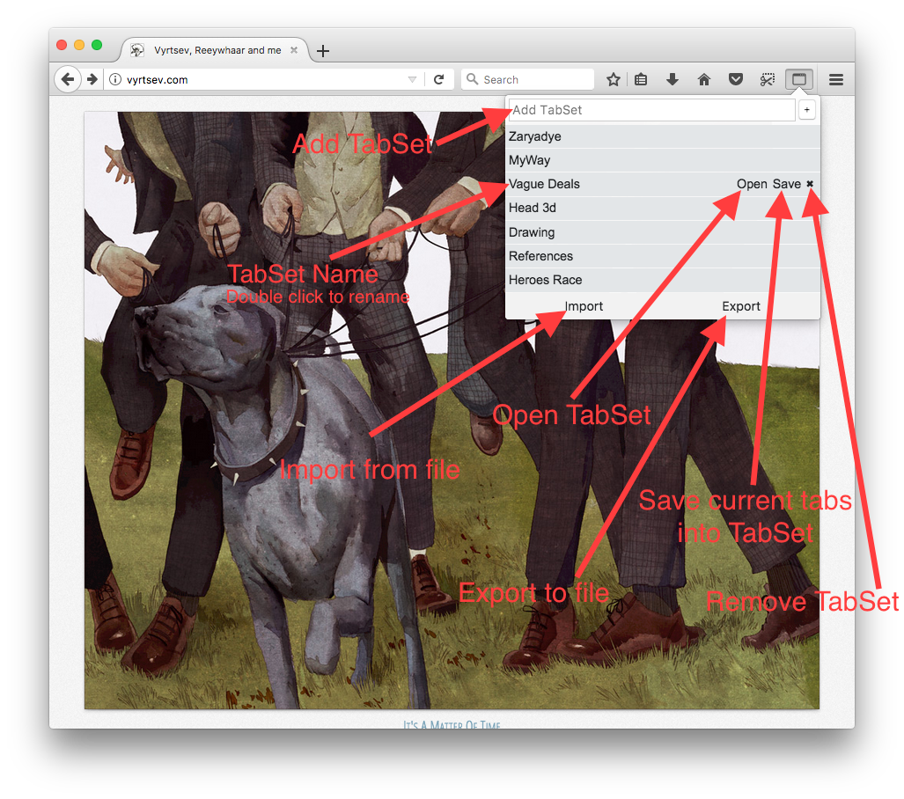
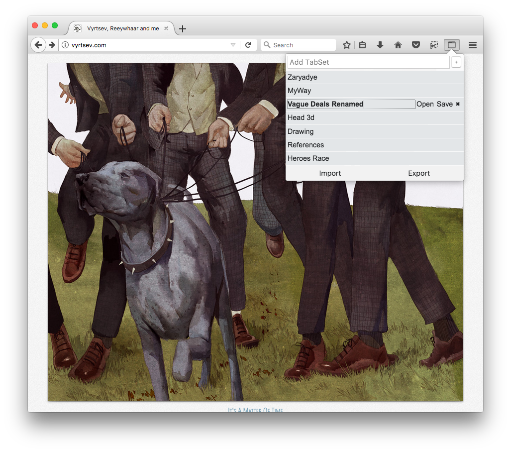

# Tab Saver

WebExtension to manage your tabs.
With this extension you can save tabs in current window and open them later.

### Caveats

Current state of Firefox WebExtension Api restricts opening of privileged urls (such as `file:///`, `chrome:`, `about:`, etc..) so placeholder page will be opened where you can copy link to clipboard and manually paste it into the location bar. Sad.

### Screenshots

