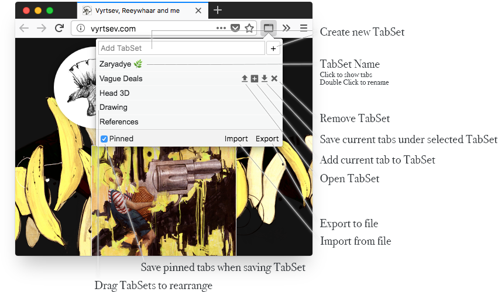
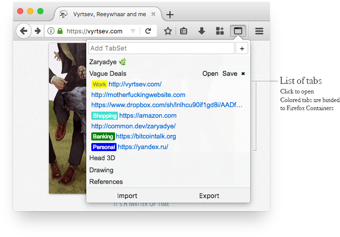

# Tab Saver

WebExtension to manage your tabs.
With this extension you can save tabs in current window and open them later.

[Install from addons.mozilla.org](https://addons.mozilla.org/en-US/firefox/addon/vyrtsev-tab-saver/)

### Caveats

Current state of Firefox WebExtension Api restricts opening of privileged urls (such as `file:///`, `chrome:`, `about:`, etc..) so placeholder page will be opened where you can copy link to clipboard and manually paste it into the location bar. Sad.

### Screenshots

## FAQ

#### When I click on `remove tab` button, nothing happens

Click and hold button. Such action made to prevent accidental remove. Other buttons with such behavior are `Undo`, `Replace TabSet`, `Remove TabSet`.

#### I don't need Window TabSets, can I hide them?

Yes. Such preference available in addon's preferences. Click on cog icon in the panel's bottom right corner, to access preferences.

#### What does `•` dot sumbol before tab's link means?

It means that tab is pinned.

#### What is `Unknown` label near tab's link.

It means that tab's container was removed

#### Can I open TabSaver in sidebar?

Yes, you can detach popup panel as well.

#### Can I have tab's title near tab's link?

Yes, available in preferences.

#### Can I have tab's favicon near tab's link?

Yes, available in preferences.

# CHANGELOG

## `v.0.1.0`
### Features

* Extension options page
* Ability to manage window's tabs
* Undo feature
* Detachable panel
* Sidebar panel
* Color may be assigned to TabSet
* Option to show tab's title
* Option to show tab's favicon
* Option to show tab's count
* Dark/light themes support

### Fixes

* Panel works in private window

## `v.0.0.1`

There were dragons...
